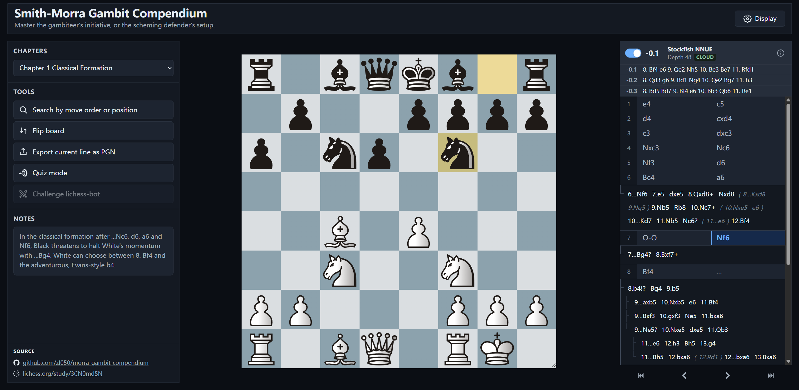

# Smith-Morra Gambit Compendium

A standalone static website for browsing a concise Smith-Morra Gambit compendium
by chapter, on an interactive board. Select a chapter or search by PGN/FEN, step
through the lines, consult pre-fetched cloud engine evals, and practise White's
moves in quiz mode.



## File structure

```
data/
  chapters/            curated PGN source files — the editable source of truth
scripts/
  export_chapters.py          data/chapters/ -> data/chapters.json
  fetch_cloud_evals.py        data/chapters.json -> data/cloud-evals.json
src/                   viewer frontend: app logic, styles, piece set, sound effects
public/                static assets
index.html             page markup
vite.config.js         dev/build config; also copies data/*.json into dist/ on build
```

## Development

Requires [pnpm](https://pnpm.io/) and Python.

```powershell
python -m pip install python-chess
pnpm install
python scripts/export_chapters.py
python scripts/fetch_cloud_evals.py
pnpm run dev
```

After editing a PGN file, run both scripts to regenerate the data files.

## License & attribution

**GPL-3.0-or-later** — see [LICENSE](LICENSE). Bundles
[`chessground`](https://github.com/lichess-org/chessground) (GPL-3.0-or-later)
and [`chess.js`](https://github.com/jhlywa/chess.js) (BSD-2-Clause).
Move-navigation icons are from the
[lichess icon font](https://github.com/lichess-org/lila) (AGPL-3.0-or-later).
